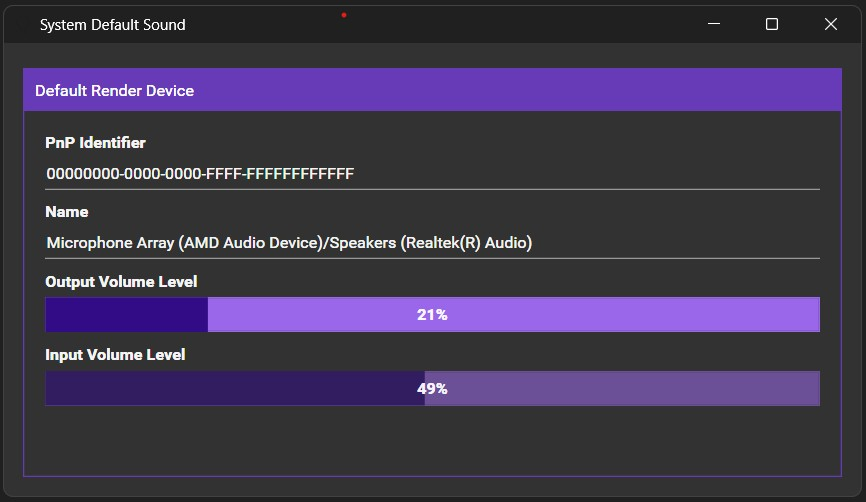

# Sound Windows Agent

Sound Agent detects and outputs plug-and-play audio endpoint devices under Windows. It handles audio notifications and device changes.

The Sound Agent registers audio device information on a backend server via REST API,
see the backend Audio Device Repository Server (ASP.Net Core) [audio-device-repo-server](https://github.com/eduarddanziger/audio-device-repo-server/)
with a React / TypeScript frontend: [list-audio-react-app](https://github.com/eduarddanziger/list-audio-react-app/)

## Executables Generated
- **SoundWinAgent**: Windows Service collects audio device information and sends it to a remote server.
- **SoundAgentCli**: Command-line test CLI.
- **HttpRequestProcessor**: RabbitMQ to REST API forwarder, which is used to forward audio device information from RabbitMQ to the backend server.
- **SoundDefaultUI**: Lightweight WPF UI showing the live volume levels of the current default audio devices.

## Technologies Used
- **C++**: Core logic implementation.
- **Packages**: Poco and cpprestsdk vcpkg packages used in order to leverage Windows Server Manager and utilize HTTP REST client code.
- **RabbitMQ**: Used as a message broker for reliable audio device information delivery.
- **WPF**: Lightweight UI for displaying live volume levels of the current default audio devices.
 

## Usage
### SoundWinAgent
1. Download and unzip the latest rollout of SoundWinAgent-x.x.x. from the latest repository release's assets, [Release](https://github.com/eduarddanziger/SoundWinAgent/releases/latest)
2. Install / Uninstall the SoundWinAgent service:
	- (elevated) SoundWinAgent.exe /registerService [/startup=auto|manual|disabled]. 
	- (elevated) SoundWinAgent.exe /unregisterService
	- net start SoundWinAgent
	- net stop SoundWinAgent
3. Start / Stop the SoundWinAgent service
4. SoundWinAgent.exe can be started as a Windows CLI, too. Stop it via Ctrl-C
5. SoundWinAgent.exe accepts following optional command line parameters
    - /url=\<URL\> can tune the URL of the backend ASP.Net Core REST API Server.
      If not set, see the configuration file SoundWinAgent.xml, apiBaseUrl element. Example:
	```
	SoundWinAgent.exe /url=http://localhost:5027
	```
    - /transport=None|Direct|RabbitMQ defines the transport mechanism to use for deliver
      audio device information to the backend server. The default is 'None' (no delivery).
	  'Direct' uses an own transient queue and HTTP client; 'RabbitMQ' uses RabbitMQ as a message broker (recommended).
	  If not set, see the configuration file SoundWinAgent.xml, apiBaseUrl element. Example:

	```
	SoundWinAgent.exe /transport=RabbitMQ
	```
6. SoundWinAgent.exe /help brings a command line help screen with all available options.
 

### Use RabbitMQ in SoundWinAgent

If you want to use RabbitMQ as a message broker (most reliable solution),
you need to install RabbitMQ (via chocolatey), rabbitmqadmin, and create the necessary exchange and queue.

```powershell
# Create exchange
.\rabbitmqadmin declare exchange --name=sdr_updates --type=direct --durable=true --vhost=/
### Create queue
.\rabbitmqadmin declare queue --name=sdr_metrics --durable=true --vhost=/
# Bind queue to exchange
.\rabbitmqadmin declare binding --source=sdr_updates --destination=sdr_metrics --destination-type=queue --routing-key=metrics-capture --vhost=/
```

Then download and unzip the latest rollout of RabbitMq-To-RESTAPI-Forwarder: HttpRequestProcessor-x.x.x. from the latest repository release's assets, [Release](https://github.com/eduarddanziger/SoundWinAgent/releases/latest) and register HttpRequestProcessor.exe as a Windows Service:

```powershell
# Register and start the RabbitMq-To-RESTAPI-Forwarder Windows Service
sc create HttpRequestProcessor binPath="<your folder>\HttpRequestProcessor.exe" start=auto
sc start HttpRequestProcessor
```

### SoundDefaultUI

1. Download and unzip the latest rollout of SoundDefaultUI-x.x.x. from the latest repository
release's assets, [Release](https://github.com/eduarddanziger/SoundWinAgent/releases/latest)
2. Run the SoundDefaultUI

    

## Developer Environment, How to Build:
1. Install Visual Studio 2022
2. download [Nuget.exe](https://dist.nuget.org/win-x86-commandline/latest/nuget.exe) and set a NuGet environment variable to the path of the NuGet executable.
3. Build the solution, e.g. if you use Visual Studio Community Edition:
```powershell
%NuGet% restore SoundWinAgent.sln
"c:\Program Files\Microsoft Visual Studio\2022\Community\Msbuild\Current\Bin\MSBuild.exe" SoundWinAgent.sln /p:Configuration=Release /target:Rebuild -restore
```

## License

This project is licensed under the terms of the [MIT License](LICENSE).

## Contact

Eduard Danziger

Email: [edanziger@gmx.de](mailto:edanziger@gmx.de)
