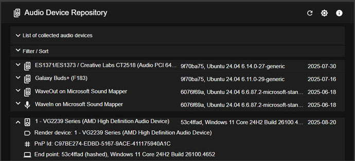

# Sound Windows Agent

Sound Agent detects and outputs plug-and-play audio endpoint devices under Windows. It handles audio notifications and device changes.

The Sound Agent registers audio device information on a backend server via REST API, using RabbitMQ To REST API Forwarder (.NET Windows Service).
The respective backend, Audio Device Repository Server (ASP.Net Core), resides in [audio-device-repo-server](https://github.com/collect-sound-devices/audio-device-repo-server/) with a React / TypeScript frontend [list-audio-react-app](https://github.com/collect-sound-devices/list-audio-react-app/), see [Primary Web Client](https://list-audio-react-app.vercel.app).
  

## Executables Generated

- **SoundWinAgent**: Windows Service collects audio device information and sends it to a remote server.
- **SoundAgentCli** (obsolete): Command-line test CLI.

## Technologies Used

- **C++**: Core logic implementation.
- **RabbitMQ**: Used as a message broker for reliable audio device information delivery.

## Usage

### SoundWinAgent
1. Download and unzip the latest rollout of SoundWinAgent-x.x.x. from the latest repository release's assets, [Release](https://github.com/eduarddanziger/SoundWinAgent/releases/latest)
2. Register / unregister the SoundWinAgent service (elevated, as admin):
    - .\SoundWinAgent.exe /registerService [/startup=auto|manual|disabled]. 
    - .\SoundWinAgent.exe /unregisterService
3. Start / stop the SoundWinAgent service
    - net start SoundWinAgent
    - net stop SoundWinAgent
4. SoundWinAgent.exe can be started as a Windows CLI, too. Stop it via Ctrl-C
5. SoundWinAgent.exe accepts following optional command line parameters
    - **[/transport=None|RabbitMQ]** defines the transport mechanism to use for deliver
      audio device information to the backend server. The default is 'RabbitMQ'
      'RabbitMQ' uses RabbitMQ as a message broker, example:
    ```
       SoundWinAgent.exe /transport=RabbitMQ
    ```
    - If /transport command line parameter is missing, the transport is tuned via the configuration file SoundWinAgent.xml, transportMethod element
6. SoundWinAgent.exe /help brings a command line help screen with all available options.

### Usage of RabbitMQ To REST API Forwarder in SoundWinAgent

1. Install RabbitMQ via chocolatey. If didn't install chocolatey yet, please follow [Chocolatey](https://chocolatey.org/install)

```powershell
# Install RabbitMQ via chocolatey (elevated, as admin)
choco install rabbitmq
```

2. Download and unzip the latest rollout of RambbitMQ-To REST-API-Forwarder: RmqToRestApiForwarder-x.x.x. from
the latest release's assets, [RmqToRestApiForwarder Release](https://github.com/eduarddanziger/rmq-to-rest-api-forwarder/releases/latest)
3. Register RmqToRestApiForwarder.exe as a Windows Service and start it:

```powershell
# Register (elevated, as admin) and start the RMQ-To-RESTAPI-Forwarder Windows Service
sc create RmqToRestApiForwarder binPath="<your folder>\RmqToRestApiForwarder.exe" start=auto
sc start RmqToRestApiForwarder
```

## Developer Environment, How to Build:

1. Install Visual Studio 2022
2. Build the solution, e.g. if you use Visual Studio Community Edition:
```powershell
%NuGet% restore SoundWinAgent.sln
"c:\Program Files\Microsoft Visual Studio\2022\Community\Msbuild\Current\Bin\MSBuild.exe" SoundWinAgent.sln /p:Configuration=Release /target:Rebuild -restore
```

## Changelog
- 2025.09 Added RabbitMQ transport option.
- 2025.09 Added default render/capture device info to device properties/events.
- 2025.07 Added OS name to REST API messages.
- 2025.07 Added messages: Device Discovery/Confirmed, VolumeRenderChanged, VolumeCaptureChanged


## License

This project is licensed under the terms of the [MIT License](LICENSE).

## Contact

Eduard Danziger

Email: [edanziger@gmx.de](mailto:edanziger@gmx.de)
